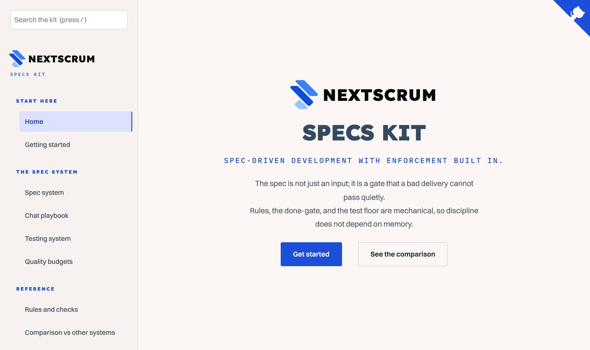

<!-- Copyright (c) 2026 NextScrum LLC. Apache-2.0 Licensed. -->

# NextScrum Specs Kit

[](https://github.com/Nextscrum-LLC/Nextscrum-Specs-Kit/actions/workflows/ci.yml)
[](LICENSE)



A forkable, stack-neutral engineering operating system: spec-driven development,
machine-enforced discipline, and a set of Claude Code dev-workflow agents. Fork
it once per project, re-skin the stack-specific bits, and every project runs on
the same rails.

The idea most spec systems share is generation (a good spec produces good code).
This kit adds the part they skip: enforcement. The spec and the rules are a
contract, and the tooling mechanically refuses any change that violates it. See
[docs/COMPARISON.md](docs/COMPARISON.md) for how it compares to GitHub Spec Kit,
Kiro, OpenSpec, BMAD, and others.

**New here? Start with [GETTING-STARTED.md](GETTING-STARTED.md)** for a literal,
first-30-minutes walkthrough (exact commands, expected output, troubleshooting).
The rest of this file is the reference.

## What you get

```
nextscrum-specs-kit/
├── README.md                  ← you are here (overview + how-to + worked example + scenarios)
├── CLAUDE.md                  ← the project brain template (Claude Code loads this first)
├── AGENTS.md                  ← cross-tool entry (Cursor, Codex, Continue); points back to CLAUDE.md
├── RESKIN.md                  ← paste into a fresh Claude session to adapt the kit to a stack
├── package.json               ← wires `npm run audit:rules` + husky
├── .husky/                    ← pre-commit / commit-msg / pre-push enforcement
│   ├── pre-commit             ← runs audit:rules + tests
│   ├── commit-msg             ← blocks AI co-author, em dashes, non-Conventional subjects, missing markers
│   └── pre-push               ← version-drift + test gate
├── .claude/
│   ├── rules/engineering.md   ← architecture, security baseline, modularity, commenting, review-marker map
│   ├── settings.json          ← permissions + auto-approve policy
│   ├── agents/                ← seven dev-workflow agents (chain-tracer, code-reviewer, db-reviewer,
│   │                            handoff-writer, requirements-ledger, playwright-runner, mockup-checker)
│   └── commands/              ← slash commands (specify, plan, tasks, analyze, record-facts, qa, audit, ...)
├── scripts/
│   ├── audit-rules.mjs        ← the orchestrator (auto-discovers scripts/rules/*.mjs)
│   ├── check-ledger-done-gate.mjs   ← the done-gate (no entry is "done" below NextScrum-manual)
│   ├── check-review-markers.mjs     ← the review-marker rule
│   └── rules/                 ← individual checks (voice, AI co-author, spec refs, test coverage, ...)
└── docs/
    ├── SPEC-SYSTEM.md         ← the lifecycle: Rules → Specify → Plan → Analyze → Build → Record
    ├── SPEC-PLAYBOOK.md       ← the chat-driven control surface + protective gates + scenarios
    ├── TESTING-SYSTEM.md      ← clarify pass, ISO/IEC 25010 dimension matrix, SPEC-NNN/C#/dim/case ids
    ├── COMPARISON.md          ← how this kit compares to other spec systems
    ├── quality-budgets.md     ← the numbers tests assert against (re-skin per project)
    ├── requirements.md        ← the ledger (single source of truth; ships empty with one example)
    ├── decisions/             ← Architecture Decision Record (ADR) format + template
    ├── sessions/              ← session-log template (handoff discipline)
    ├── post-mortems/          ← post-mortem template
    └── specs/000-example-feature/  ← a tiny worked example, fully traced spec → plan → tasks → tests
```

## The core idea

Two layers, and only one of them changes per project:

- **The methodology layer** (specs, gates, agents, voice rules, ledger, done-gate)
  is stack-neutral. You do not rewrite it. You inherit it.
- **The stack layer** (which database, which test runner, which file globs the
  review markers watch) is the only thing you re-skin. Every spot that needs a
  per-project value is marked with a `> RESKIN:` note or a `<PLACEHOLDER>`.

The promise: discipline is mechanical, not remembered. Husky refuses commits that
skip the rules; the done-gate refuses to mark work finished before a human has
verified it; the coverage rule refuses to let an acceptance criterion ship
without a test that references it.

## Quick start (forking the kit for a new project)

1. Copy this folder into your new project's repo root (or `git clone` the kit
   repo and remove its `.git`, then commit into the new project).
2. Install hooks and dev deps:
   ```bash
   npm install
   npm run prepare        # installs husky
   ```
3. Open the project in Claude Code and paste the contents of `RESKIN.md` as your
   first message. The session reads the kit, drops anything that does not apply,
   and swaps the `<PLACEHOLDER>` values for your stack. Confirm each step.
4. Replace `CLAUDE.md` placeholders (`<PROJECT>`, `<STACK>`, locked decisions,
   rules index) with your project's reality.
5. Run `npm run audit:rules`. Fix anything it flags. Green means the rails are live.
6. Start your first feature: in Claude Code, run `/spec`, write the spec under
   `docs/specs/NNN-name/`, run `/spec-tests`, build, then commit (the hooks gate it).

## The daily loop (how a feature actually flows)

```
/spec                       → branch + ledger entry with acceptance criteria
docs/specs/NNN/spec.md         → EARS criteria (C1..Cn)
/plan  /tasks  /analyze        → the how, the work units, the read-only consistency check
/spec-tests                    → clarify pass → tagged tests + tests.md coverage matrix
   ... build ...
npm run audit:rules            → voice, spec refs, test coverage, AI co-author, review markers
git commit                     → husky runs audit + tests; commit-msg enforces markers + Conventional format
ledger entry → done            → blocked until verification reaches NextScrum-manual (the done-gate)
/record  /handoff        → update the architecture docs; write a session log before /compact
```

You never have to remember the discipline. The tools enforce it.

## A worked example: a SaaS, feature by feature

The scenarios further down show the kit re-skinned for different *shapes* of
project. This section is the opposite: one project, followed closely, so you can
watch a single idea travel through every stage and land as code with tests and a
paper trail.

The product: **Deskline**, a small support help desk. A company signs up, its
customers file support tickets, and its agents reply. We will ship two features
and watch the kit turn each one into specs, tasks, rules, and the checks that
hold them in place.

### Step 0: the one rule this product cannot live without

Deskline is multi-tenant: many companies share one database, and Company A must
never see Company B's tickets. That is not a feature, it is a law. So before any
feature, you lock it as a rule.

Run `/rule` and describe it: "every database read or write is scoped to the
current tenant." The command assigns the next free number (R13, since the kit
ships R1 through R12), adds a row to the rules table in `CLAUDE.md`, and scaffolds
a check under `scripts/rules/` that flags any query missing a `tenant_id` filter.
Now the rule is enforced, not remembered: a commit that adds an unscoped query
fails `npm run audit:rules` before it can land.

> Touches: `CLAUDE.md` (the rule row), a new check under `scripts/rules/`, and
> from now on every commit (the gate runs the check).

### Step 1: feature one, "a customer files a ticket"

The ask, in plain words: a signed-in customer types a subject and a message, hits
Submit, and the ticket is saved and appears in their list.

**Specify.** Run `/spec file-a-ticket`. Because this touches three layers (a form,
a backend route, and the database), the three-question test says it earns a
folder: `docs/specs/001-file-a-ticket/`. You write `spec.md` with the *what + why*
and the acceptance criteria as EARS sentences:

- WHEN a signed-in customer submits a subject and a message THE SYSTEM SHALL save
  the ticket against their tenant and return its id.
- IF the subject is empty THEN THE SYSTEM SHALL reject the request and SHALL NOT
  write a row.
- WHILE the save is in flight THE SYSTEM SHALL disable Submit and show a busy state.

Under "Rules touched" you list R9 (tenant scope) and the voice rules (R1-R2) for
the button and toast copy.

**Plan and tasks.** `/plan` writes the contract (the request shape, the `tickets`
table columns, the route signature). `/tasks` breaks it into work units, and this
is where you see one feature land on three different systems:

| Task | System it touches | What it is | Review marker | Agent that checks it |
|---|---|---|---|---|
| T1 | Database | migration: `tickets` table with a `tenant_id` column and an index on it | `[db-reviewer-ok]` | db-reviewer |
| T2 | Backend | `POST /tickets`: validate input, scope the insert to the tenant, return the id | `[chain-tracer-ok]` | chain-tracer |
| T3 | UI | the ticket form wired to the route, with the busy state | `[chain-tracer-ok]` | chain-tracer |

Each task names the EARS criterion it satisfies, so there are no orphan tasks.
Build order follows the dependency: the table first (T1), then the route that
writes to it (T2), then the form that calls the route (T3).

**Analyze, then build.** `/analyze` reads spec, plan, and tasks together and
confirms every criterion has a contract and a test, and that nothing breaks R9.
Then you build each task as one commit. When you stage the migration, the
commit-msg hook sees a database file and refuses the commit until the message
carries `[db-reviewer-ok]`, which you add after running the db-reviewer agent.
The route commit needs `[chain-tracer-ok]` the same way. The new R9 check runs on
every one of these commits, so the moment T2's insert forgets the tenant filter,
the gate stops it.

### Step 2: feature two, "an agent replies and the customer is emailed"

The ask: an agent opens a ticket, writes a reply, and the customer receives that
reply by email.

This one depends on feature one (no reply without a ticket), so its `spec.md`
records **depends-on: SPEC-001**. The done-gate will not let SPEC-002 reach `done`
while SPEC-001 is still open, and the cycle check rejects the relationship if you
ever point two specs at each other by mistake.

It also brings a new kind of risk: the app now sends email to an address pulled
from the database, and the reply body is user-typed text going out under your
domain. The kit's answer to a new concern is always the same: make it a rule or a
test, not a hope.

- The outbound address is data, so the route validates it and the send goes
  through one audited path (the security baseline in `engineering.md` already
  names this pattern; you point it at your mailer).
- If your product had no rule against one tenant's reply reaching another tenant's
  thread, you would add one now with `/rule`, exactly as in Step 0.

The tasks again split by system: a backend task for the reply route and the
mailer call (chain-tracer marker), a database task if the reply needs its own
table (db-reviewer marker), and a UI task for the reply box. Each carries the
criterion it satisfies and the marker its file pattern demands.

### What the example shows

One ask becomes a spec; one spec becomes tasks that each land on a different
system; each system has a check that fires automatically at commit time; and a
concern that crosses features (tenant isolation, safe email) becomes a numbered
rule with a script behind it rather than a note someone has to remember. You
describe the *what*, and the rails make sure the *how* cannot skip a step.

## Example scenarios

The worked example above followed one project end to end. These three show the
same kit bent to different project shapes, and what changes in the re-skin.

### Scenario A: a greenfield service

You are starting a new service on Node + Postgres.

- Fork the kit, run `RESKIN.md`. The session sets `<DB_ENGINE>` to Postgres in
  `db-reviewer`, points `playwright-runner` at your `npm run e2e`, and sets the
  review-marker globs to `src/db/**` and `src/routes/**`.
- Delete `docs/specs/000-example-feature/` once you have read it; it is a teaching
  artifact.
- First feature: `/spec export-users` → spec with 4 EARS criteria →
  `/spec-tests` → build → commit. The done-gate keeps the ledger honest.

### Scenario B: a managed-WordPress practice (dependency-lean)

A common agency model: build clients a site that depends on the minimum number
of third-party plugins, because each plugin is unaudited code with full database
and filesystem access (plugins and themes are the source of most WordPress
compromises). The kit makes that promise enforceable rather than aspirational.

- **Stack re-skin:** `db-reviewer` targets `$wpdb` and prepared statements;
  `chain-tracer` traces WordPress hook → must-use plugin → `$wpdb` → template
  render; review-marker globs watch `mu-plugins/**` and `theme/**`.
- **Each plugin you replace becomes a spec.** "Replace the contact-form plugin"
  is a `docs/specs/NNN-contact-form/` folder with EARS criteria for the feature
  set actually used, and the security dimension mandatory in `tests.md` (nonce,
  capability check, sanitisation, escaping).
- **The security claim is enforced, not promised.** The mandatory test floor
  (functional + security + accessibility) is what makes "fewer plugins" mean
  "safer" rather than "differently risky." A replacement that removes a plugin
  but ships an unparameterised query cannot pass the gate.
- **Add project rules** in `CLAUDE.md` (parameterised queries, nonce plus
  capability on every admin action, escape on output) and pin each one as a
  check in `scripts/rules/` so it cannot drift.

### Scenario C: a multi-repo platform

An API backend, an admin frontend, a storefront, and a mobile app, each in its
own repository. The challenge is one source of truth across many repos.

- **A control-plane repo** forks the kit and holds the master ledger for
  cross-repo epics, the shared ADRs, and the versioned API contracts (OpenAPI or
  JSON schemas) that every client consumes. Contract-first is the real coupling
  point; version it there.
- **Each code repo forks the kit too**, keeps a local ledger for repo-internal
  work, and re-skins its own stack (for example `db-reviewer` to the backend's
  database, `chain-tracer` to route → controller → model → API resource → UI).
- **A cross-repo feature is an epic in the control plane**, sharded into per-repo
  specs. The epic cannot reach `done` until every shard's done-gate passes.
- **Improve the kit once, upstream.** Sharpen a rule in the kit repo and re-pull
  into each fork, rather than editing many copies.

## Re-skin map (what changes per project)

| Spot | Placeholder | Set it to |
|---|---|---|
| Database review | `<DB_ENGINE>` in `.claude/agents/db-reviewer.md` | Postgres / MySQL / `$wpdb` / etc. |
| Call-chain layers | layer names in `.claude/agents/chain-tracer.md` | your real UI → backend → DB layers |
| E2E command | `<E2E_RUN_COMMAND>` in `playwright-runner` + `.husky/*` | `npm run e2e`, `php artisan test`, etc. |
| Review-marker globs | placeholders in `check-review-markers.mjs` + `engineering.md` | your DB / service / UI directories |
| Voice scan scope | `USER_FACING_DIRS` in `scripts/rules/06a`, `06b` | folders holding client-facing copy |
| Version drift | `<VERSION_FILE>` in `.husky/pre-push` | `package.json`, plugin header, etc. |
| Quality budgets | numbers in `docs/quality-budgets.md` | your real performance / a11y / size budgets |
| Test runner | the `test` script in `package.json` + hooks | your actual runner |

Every one of these is greppable: search the kit for `RESKIN` and you have the
full to-do list.

## Conventions inherited from the kit

- Commit format: Conventional Commits (`type(scope): subject`). Enforced.
- No em dashes, no AI tells, no AI co-author trailer in anything shipped. Enforced.
- Every requirement carries acceptance criteria and cannot be called done before
  a human verifies it (the done-gate). Enforced.
- Every EARS criterion is referenced by a test (the coverage rule).

## Documentation website

The kit ships a browseable docs site (Docsify) that renders these same markdown
files with a full-text search box, grouped navigation, and a cover page. It reads
the live `.md` files, so the site never drifts from the docs.

Run it locally:

```bash
npm install
npm run docs:serve
# then open http://localhost:4000
```

No Node handy? Any static server works (the site uses hash routing), for example
`python -m http.server 4000`. Press `/` on any page to jump to search. To publish
it, push the repo to GitHub and enable Pages on the root (the `.nojekyll` file is
already there so Pages serves the dot-folders correctly). The site files are
`index.html`, `_sidebar.md`, and `_coverpage.md` at the repo root.

## License and trademarks

Licensed under the Apache License, Version 2.0. See [LICENSE](LICENSE) and
[NOTICE](NOTICE).

NextScrum and the NextScrum logo are trademarks of NextScrum LLC (application
pending). The license covers the source code, not the NextScrum name or logo.

Maintained by [NextScrum LLC](https://nextscrum.com). Issues and feedback are
welcome (see [CONTRIBUTING.md](CONTRIBUTING.md)); external pull requests are not
being accepted at this time.
